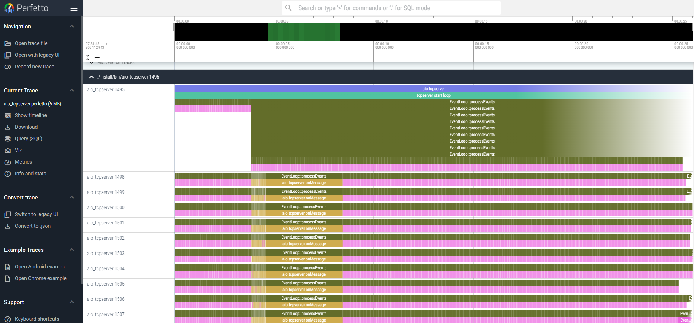

# posix-bsp-perf
bsp perf test for posix OS(such as Linux/QNX/Rtthread)

## Design doc

You can follow the AI generated wiki to get the Structure of the project and ask AI the question and demo.

[Design doc](https://deepwiki.com/zczjx/posix-bsp-perf)

## Build in Docker

- Dockerfile.base is base image for building
- Dockerfile is the actual building env for posix bsp(use this one)

1. Refer to the command in [get_build_env_docker.sh](./get_build_env_docker.sh) to build the docker image. When completed, you will get a docker image named `bsp-perf-build-env-x86:v0.0.1` from pulled image `zczjx/bsp-perf-build-env-x86-base:latest`。

2. Run the docker start command in [get_build_env_docker.sh](./get_build_env_docker.sh), you can ignore gpus if you don't have one. Remember to map the posix source directory to the container using -v option.

3. After the container started, you can refer to the command in [reference_build_cmd.sh](./reference_build_cmd.sh). The spdlog and CLI env has already been setup in the container. Checking building options in rk3588s or other platform, and now start building.

## Build locally(Not recommended)

please reference the cmd in [local_env_pkgs_intall.sh](./local_env_pkgs_intall.sh) to install the packages to setup
the local native build env if required(or you don't like to use docker)

## BSP Trace Event Visualization

upload the *.perfetto profiler file to [perfetto](https://ui.perfetto.dev/) to analysis the perf data at local web browser

- BspTrace visualization demo

  

## Tracing Branch

Tracing branch(``git checkout -b tracing origin/tracing``) is for deep tracing in the src code, will leave so many trace event tags in the code for analysis
User could do ``git pull origin master --rebase`` to sync and merge the latest master ToT to tracing branch
